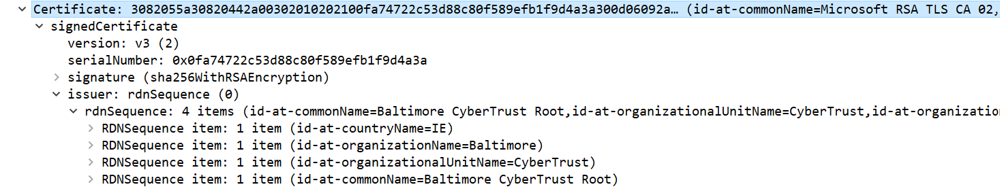

# TLS Handshake
> [https://zhuanlan.zhihu.com/p/75461564](https://zhuanlan.zhihu.com/p/75461564)<br>
> [https://blog.catchpoint.com/2017/05/12/dissecting-tls-using-wireshark/](https://blog.catchpoint.com/2017/05/12/dissecting-tls-using-wireshark/)
> Environment: win10; wireshark;

## Capture packets
- `$ ipconfig /flushdns` # clear dns cache to catpure the dns query packets
- open **wireshark** to capture all network packets
- visit *https://cn.bing.com* in browser <br>
  Note:
    - don't refresh opened page, otherwise the session will be reused, and there will be no tls handshake packets <br>
    - *https://google.com* use TLS 1.3, which seems have different handshake flow
- tips: ip.dst == ${DNS_SERVER_IP} to filter the dns query packets to locate our target packets <br>


## Packets Anatomy
> filter ip.src == ${HOST_IP} || ip.dst == ${HOST_IP}

### Client hello


1. Version: client used TLS version
2. Random: for aes key gen
3. Session ID: for session reuse
4. Cipher Suites: the tls cipher suites that client support

### Server hello


Cipher Suite: Cipher Suite: 
TLS_ECDHE_RSA_WITH_AES_256_GCM_SHA384
1. TLS protocol
2. use ECDHE and RSA for exchange shared key
3. use AES 256 GCM for data encryption
5. use SHA384 for MAC(Message Autentication Code, check message integrity)

### Certificates


certificates chain:
1. the first certificate is the certificate of the current domain (CN, i.e. common name, of the cert)
2. the latter certificate in the cert chain is the cert of the CA that issue the former certificate.
3. the last cert in cert chain is issued by root certificate, which should can be obtained from OS
e.g. in this example, <br>
the first cert is the cert for cn.bing.com; <br>
the second cert is the cert of Microsoft Corperation, who issue the first cert;<br>
the second cert is also the last certificate, whose issuer is the root cert, which can be find in Win10 **Trusted Root Certification Authority Store** 



### Certificate status

if **Client hello** extension include **status_request**, return this message, containing OCSP(online certificate status protocol) (let server return cert status with signature, client validate signature to trust it's from OCSP server, so server can cache, OCSP server will not be overwhelmed by too many client calls)

### Server key exchange


ECDHE parameters
choosed curve: secp384r1
Pubkey: for client to gen the shared key

### Server hello done
empty packet body

### Client key exchange


Pubkey: return to server for server to gen shared key. (Note: encrypted with the public key in the cert of bing.com)

### Change cipher spec


tell server the future messages will be encrypted using aes384 gcm(previous negotiated) and the shared key(previous exchanged)

### Encrypted handshake message(client finished)

AES(all previous exchange messages + "client finished", the common key exchanged just now)

## Lab
### RSA decryption/encryption example
*check code*
### Validate certificate signature
*check code* <br>
**CertEncrypted** = 96fd858c07a340af492e44938202794cf8aca6485c640cc5870cf10346bfb01f0a9500d7e3f728afb2ff2e462917b41281a496a7f8f06815ce8dcbad6298adc3dee6abcb952d6283e37d20e1abd95f4ccf429cf138c7e43cece0f5062707231dcc857fb27bea88efb04a7e83405d4a1441e1fe272104c32a968c53f84a74a506a2b35714ff789055b08417b0786b3b0a00b46a2210a628de6b2f0e848872e21437bc92143bb4a694617b4897f2df26ad33e10ecff398fd147b5c01b731545a281c20fd6035e5250c9ed73ed3af7ee7b27dc16e8854614702efbc210adf5f4af3c860051acd3344db79831d19216e7a90a6c3bb417330b07b27e5b557a4219c2a8907f8f274a4ffc391fb0e0ef5a7182e5afe0f5f2ba61f8cc69f009e3db187b92d4bf0f60207065bd83b84c104b4e8b99475f4c2d161f738cb013b2386aad1d9da7021c6ede94fbac1634cbb70725ad203614ec8e1ed0fcc7c6e68e5e6b4573c9e8c231e2e39bb3e8a64756364d982290ed255142a4a597705ed10962da559c190942f5c79d42aab1d193dbccd21fcfd2f739064459becc02437c4397256b04c7f68f73679b1d77e60821f6f1a9fafa47f666090853c7157caa5851b81f350e63122ad2dbbdeee1a61dae4593b1023484b81b584e2a731ee62ac6595483486aad9d9c589494b7dfbb05ae7b66e3688b0a1d094ef1d8afe605e0f538029f32ee1<br>

**IssuerCertPublicKey** = 3082020a0282020100**f4c01959aa2a247c062131d1ee12f5816a94e3f6d14a2fe35db12e291438bccc955d2907d1f85d37f420d7b43f583a7a92ee8f3cfa2b0a72039e40d4eb8b8ef698f9e7f0ddef3c25f46c3384564fa7919348040df3029bc61a0ff8d1386fefc90097189b322a6c29a85d6eea07072381e19958a2d70185ffce6d47fae640917d731142a38a5a464b92294f3e7df3918339187c5e23830d6754a82811281dad84fee0f005057169d63849165617131dec04722380b3d6293837667a00b0f731f8c0804103c28927cb0f531afaf83ee6c065da94e75d7334b0686af6abd8e0154e5d1375d8fe44085b9d7d7fcf2a6a93e89fbfe7770a08836bc31bbe8d6ed90f27b9406b29552647a123915fdd0eb22c51a53ae37bff5a9fee13bc4b0dd842e6ba652bdb2236562884c4cc28b0248f155e58159b423ed1122724212a5cfb2a308b7c94acee650a03402ab08d630fb001f02f84590e7aa3e6ea43f8d481d55d5b46342fd4a2071d88a52247f379f487d807ea36bf9e06316fae6d20b706884b15b868fe8659e57cae94864aef9a704c799ab8221e13972553d8afa4bc0f4f1f5bd159e8f7e029125ac581d634fd8299e3a19f8ce0bdb5ae06db9549d562ac32658bb73cab7e0c1b628a6ab9977bdb87c5769becc5f22f306e66dd51644e13aacec3adb437147f2313a8cda96a7e2dc46e7cbb1349d0c8d1d375021142d153ea8c9f**02030**10001**<br>
former bold = public_key.N<br>
latter bold = public_key.e

**decrypted** = encrypted^e%N = 1ffffffffffffffffffffffffffffffffffffffffffffffffffffffffffffffffffffffffffffffffffffffffffffffffffffffffffffffffffffffffffffffffffffffffffffffffffffffffffffffffffffffffffffffffffffffffffffffffffffffffffffffffffffffffffffffffffffffffffffffffffffffffffffffffffffffffffffffffffffffffffffffffffffffffffffffffffffffffffffffffffffffffffffffffffffffffffffffffffffffffffffffffffffffffffffffffffffffffffffffffffffffffffffffffffffffffffffffffffffffffffffffffffffffffffffffffffffffffffffffffffffffffffffffffffffffffffffffffffffffffffffffffffffffffffffffffffffffffffffffffffffffffffffffffffffffffffffffffffffffffffffffffffffffffffffffffffffffffffffffffffffffffffffffffffffffffffffffffffffffffffffffffffffffffffffffffffffffffffffffffffffffffffffffffffffffffffffffffffffffffffffffffffffffffffffffffffffffffffffffffffffffffffffffffffffffffffffffffffffffffffffffffffffffffffffffffffffffffffffffffffffffffffffffffffffffffffffffffffff003031300d06096086480165030402010500042019f14e3a56ee8b981209dafc195304ad**bb10657b7862582522436b978a16a1e9**

**tbsCert**


```
$ openssl dgst -sha256 ./tbsCert.dat
SHA256(./tbsCert.dat)= 19f14e3a56ee8b981209dafc195304adbb10657b7862582522436b978a16a1e9
```

### Use self-signed cert on a server
> [https://serverfault.com/questions/880804/can-not-get-rid-of-neterr-cert-common-name-invalid-error-in-chrome-with-self](https://serverfault.com/questions/880804/can-not-get-rid-of-neterr-cert-common-name-invalid-error-in-chrome-with-self)

```
openssl req \
-newkey rsa:2048 \
-x509 \
-nodes \
-keyout file.key \
-new \
-out file.crt \
-subj /CN=Hostname \
-reqexts SAN \
-extensions SAN \
-config <(cat /etc/ssl/openssl.cnf \
    <(printf '[SAN]\nsubjectAltName=DNS:hostname,IP:192.168.0.1')) \
-sha256 \
-days 3650
```
```
$ apt update
$ apt install nginx
$ sudo vim /etc/nginx/conf.d
```

### Trust the self-signed cert
Install to Trusted Root Certification Authority Store

### Use self-signed CA & Trust
> (https://stackoverflow.com/questions/7580508/getting-chrome-to-accept-self-signed-localhost-certificate)[https://stackoverflow.com/questions/7580508/getting-chrome-to-accept-self-signed-localhost-certificate]

## Thinking
- How this avoid 中间人攻击
- How local software use this cert to check if a software install package is trustable
- How ssh fingerprint work
  - azure vm -> Run command: `$ ssh-keygen -l -f /etc/ssh/ssh_host_ecdsa_key.pub `
  - check the fingerprint get by local client

